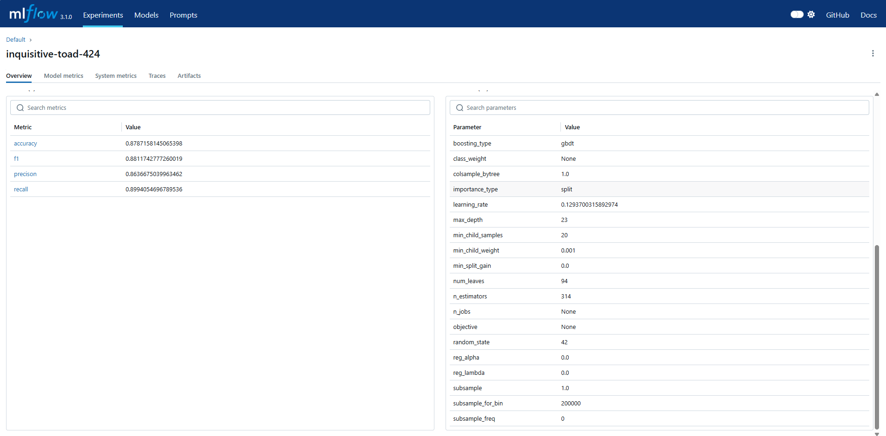
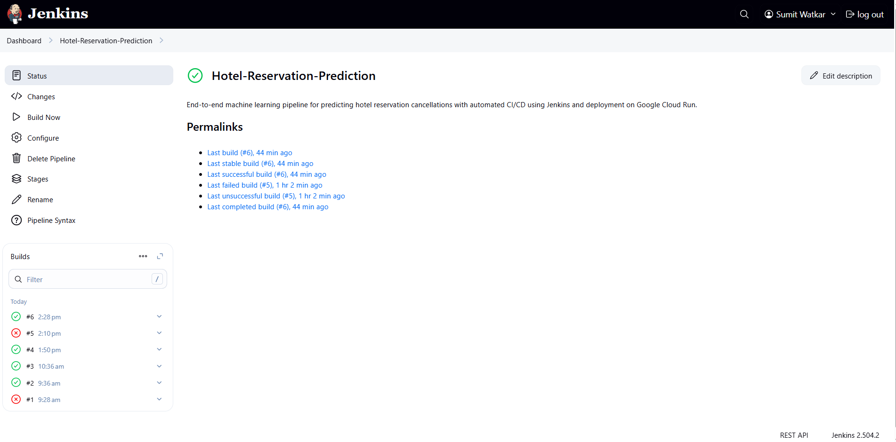
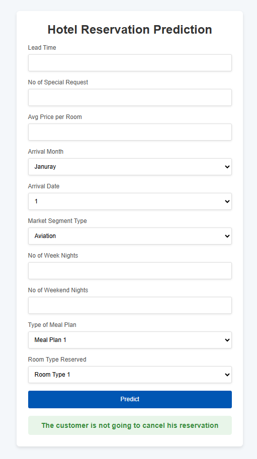

# 🏨 Hotel Reservation Prediction – End-to-End ML Deployment using Jenkins and Google Cloud

## 📌 Overview

The **Hotel Reservation Prediction** project is a machine learning system that forecasts whether a hotel booking will be canceled.  
It enables better inventory planning, reduces revenue leakage, and supports intelligent overbooking strategies.

> 🔗 **[Live App URL](https://hrp-552900362680.us-central1.run.app/)**

---

## 🧰 Technologies and Tools Used

| Category             | Tools/Tech                                        |
|----------------------|---------------------------------------------------|
| ML & Processing      | Python, Pandas, Scikit-learn                      |
| Modeling             | Random Forest, Light Gradient Boosting Machine    |
| Experiment Tracking  | MLflow                                            |
| API & Serving        | Flask                                             |
| CI/CD                | Jenkins, GitHub                                   |
| Containerization     | Docker                                            |
| Deployment           | Google Container Registry, Google Cloud Run       |

---

## 📊 MLflow Experiment Run

The model was trained and tracked using **MLflow** with the following metrics and hyperparameters:

---

## 🧪 Jenkins CI/CD Pipeline

This project is integrated with a **CI/CD pipeline** using Jenkins:

### 🔹 Pipeline Stages
1. Clone GitHub Repository  
2. Set up Python Virtual Environment  
3. Install Dependencies  
4. Build and Push Docker Image  
5. Deploy to Google Cloud Run  

### 🔹 Status
- ✅ Automated builds and deployment with success history  
- 🚀 Final build `#6` successfully deployed the app  

---

## 🚀 Outcomes

- ✅ **Accurate Cancellation Prediction**
- ⚙️ **Fully Automated CI/CD Pipeline**
- ☁️ **Cloud-native, Serverless Deployment**
- 📦 **Portable, Dockerized App**
- 🔁 **Reproducible Experiments via MLflow**

> 

---
